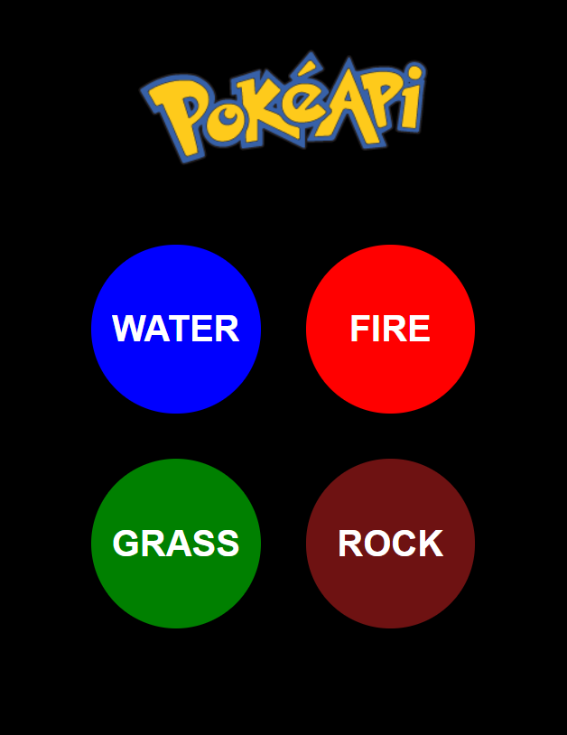
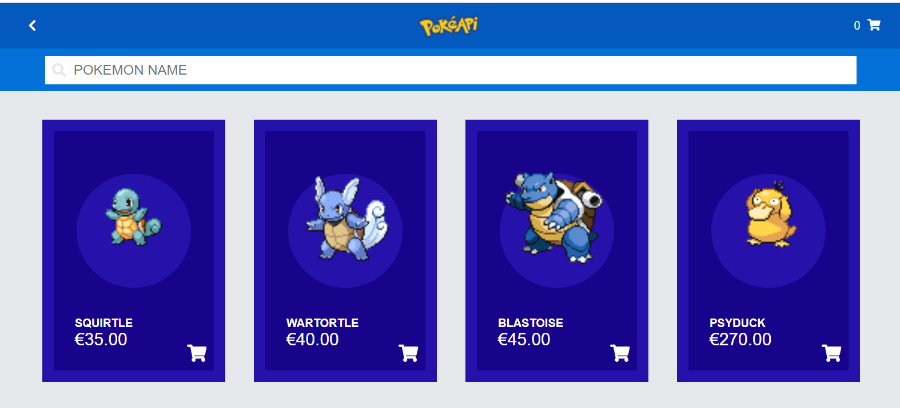
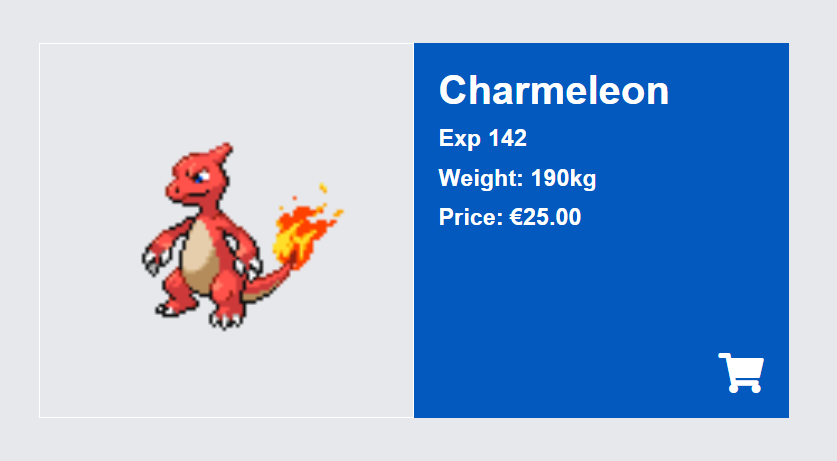
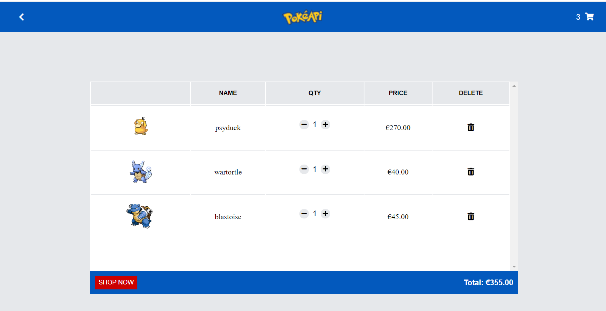

# DEMO
https://pokemon-shop-pbmzhkqwi-raphaelbmesquita123.vercel.app/

# POKEMON STORE
#### HOME PAGE
- You can choose to see the pokemon by its type
 

#### STORE PAGE
- You can search for a pokemon card
- Add the pokemon to your basket
- Clicking on the image you can see more details about it

#### POKEMON DETAILS
- See more details about the pokemon
- Add to your basket

#### BASKET PAGE
-You can add more pokemon's card and finish your payment

# Technology
- ReactJs
- React Hooks
- Axios
- Font Awesome
- Sass

# Runing the project
yarn to install or npm install

# Conection center

<a href="https://www.linkedin.com/in/raphael-mesquita-135996139/" style="display: flex;  justify-content: center; align-items: center; text-decoration: none; color: #e69d58;">
  
 
Linkedin

</a>

<a href="https://www.instagram.com/raphaelbmesquita" style="display: flex; justify-content: center;align-items: center; text-decoration: none; color: #e69d58;">
  
 
Instagram

</a>

<a href="https://www.facebook.com/raphael.brandaomesquita/" style="display: flex;  justify-content: center; align-items: center; text-decoration: none; color: #e69d58;">
  
 
Facebook

</a>

 

℗ 2021 Raphael Mesquita
